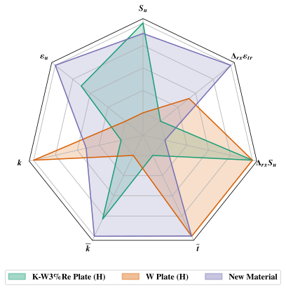

# Overview
This project is concerned with modeling material structural and thermal properties for tungsten and tungsten alloys. In particular the material ultimate tensile stress (UTS), $S_u$ the material uniform elongation $\varepsilon_u$, the material creep stress $S_t$, and the conductivity $k$. Empirical models are proposed for incorporating the effect of material recrystallization, a phase change process that depends upon time and temperature. The primary statistical methods used in the repository are techniques from **linear regression (model selection, residual analysis, model adquecy checking)** and **Bayesian statistics (MCMC sampling, hierarchical modeling)**.  More detailed overviews for either are available in the `README.md`'s in [engineering_models](./engineering_models/) and [recrystallization](./recrystallization/) respectively. Full detail is contained in the notebooks referenced in these `README.md`'s in the folders.

## Highlights
I've included some highlights and applications of the inference and modeling in this project below.
### Material Recrystallization

#### Isothermal Recrystallization
The figure below shows predicted isothermal recrystallization phase fraction $X: (t,T) \to [0,1]$ as a function of time at two different isotherms, with the model calibrated to data from [A. Lopez (2015)](https://orbit.dtu.dk/en/publications/thermal-stability-of-warm-rolled-tungsten). The solid black lines shows the maximum likelihood predictions while the dotted black lines show 95\% confidence intervals based on sampling from the posterior predictive distribution. The variable $X = 0$ when no recrystallization (a phase change process) has occured and $X = 1$ when the entire material has changed phase.

%20-%20MR_data_example.svg)

The parameter $\overline{k}$ developed [here](./recrystallization/model_inference/latent_variable_selection.ipynb) describes how quickly the rate of recrystalliation proceeds, smaller $\overline{k}$ means that recrystallization proceeds more quickly, while larger $\overline{k}$ means it is slower (which is desirable for engineering applications). The below figure compares posterior distributions of this parameter for tungstens processed using different routes obtained via sampling from a bayesian hierarcichal model:

### State Properties

#### Parametric Modeling
It is oftentimes difficult to compare two materials as the advantages confered to one material property may come at the expense of another. Morever, for material state properties, i.e. $S_u, \varepsilon_u, k$ the properties are functions of temperature. For material recrystallization phase fraction $X$, $X$ is a function of time and temperature. 

We can characterize the "overall" performance for each property, for each material over the whole considered temperature range, and represent each material parameterically. This is demonstrated in [parametric_application.ipynb](./engineering_models/visualizations/parametric_application.ipynb) for material state properties while develppment of the overall rate of recrystallization $\overline{k}$ and overall incubation $\overline{t}$ are developed [here](./recrystallization/model_inference/latent_variable_selection.ipynb). We can then compare existing tungten's with "hypothetical" tungstens, that follow the same trends over temperature as existing materials, but feature improved and desired characteristics, demonstrated in the below figure. This example hypothetical material has slightly smaller $S_u$ then the high performance alloy K-doped 3%Re Tungsten, but much greater than pure W. It has intermediate conductivity and much larger $\varepsilon_u$ than previously seen alloys. Finally, it has enhanced recrystillization resistance, beyond what has been recorded in the literature to date.

 for details](./.git_images/parametric_representation.svg)

Additional relevant properties are the $S_u$ and $\varepsilon$ (ductility) resistance to degradation from recrystallization (explained [here](./engineering_models/modeling/recrystallization_reduction.ipynb)). It's difficult to compare the advantages between materials for this many properties, but we can make a use of a radar plot to demonstrate the differences in properties visually, as shown in the below figure. We can easily visually compare the pure W with the K-doped 3%Re W alloy, and get a visual representation of some hypothetical new W.

### Coupling Recystallization
The below plots demonstrate the modeled effect of material recrystallization (with $X= 1$) on material property state functions $S_u$ and $\varepsilon_u$.

_UTS_and_UE.svg)

## Summary
The listed material properties are dependent on their temperature. Further, the structural properties, $S_u$, $\varepsilon_u$ and $S_t$ are functions of recrystillization phase fraction $X$ which describes the fraction of material that is _recrystallized_. Material _recrystallization_ describes a solid state phase change of material and is a temperature and _time_ dependent process. Material recrystallization is characterized using the material phase fraction $X: (t,T) \to [0,1]$ where $t$ is the time and $T$ is the isothermal material temperature.

The aim of this project is to obtain reasonable estimates for:

1. A material conductivity state function $k(T)$
2. A creep stress state function $S_t(T)$
3. An ultimate tensile stress path function $S_u(T(t))$
4. A uniform elongation path function $\varepsilon_u(T(t))$

where $T$ is the temperature state of the material and $T(t)$ is an arbitary temperature history. A reasonable model for $S_u(T(t))$ is 

$$
S_u(T(t)) = S_{u,0}(T(t)) - Y(T(t)) \Delta_{rx}S_{u}
$$

Where $\Delta_{rx} S_u$ is the constant decrement in $S_u$ due to full recrystallization at $X= 1$, and $Y(T(t))$ is the _nonisothermal_ recrystallization, with a similar relationship for $\varepsilon_{u}(T(t))$. Models for $S_{u,0}(T)$, $Y(T(t))$ and $\Delta_{rx} S_u$ may be estimated from seperate experiments.

### State Property Estimation
The state properties $k(T),S_t(T),S_{u,0}(T),\varepsilon_{u,0}(T)$ are modeled empirically using data reported in scientific literature along with standard methods and techniques from linear regression analysis in the folder [engineering_models](./engineering_models/). 

The isothermal recrystallization fraction $X(t,T)$ is highly nonlinear in both arguments, and the paramters for the model of $X(t,T)$ are estimated using bayesian statistics and MCMC methods, detailed in the notebooks in [recrystallization](./recrystallization/).

### Path Function Estimation
Leveraging the principle of additivity, a simple extension to the isothermal recrystallization fraction $X(t,T)$ leads to the nonisothermal recrystallization fraction $Y(T(t))$ in continuous closed form, developed and validated [here](./recrystallization/nonisothermal_modeling/).
