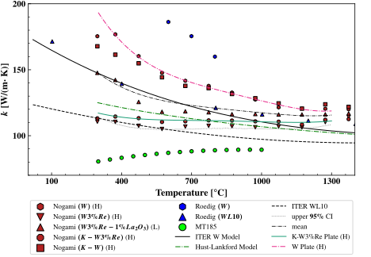

# Overview

Empirical engineering material property models for tungsten alloys are developed in these notebooks using data reported in scientific literature along with standard methods and techniques from regression analysis. **If you would like to begin immediately browsing notebooks please start with [modeling ultimate tensile strength](uts_modeling.ipynb).**

## Summary
The analysis developed in the notebooks consists of [exploration/initial visualization](./data_exploration/), [model development](./modeling/) and [additional visualizations](./visualizations/). The specific material properties modeled are:

1. Ultimate Tensile Stress: $S_u$ or $S_{uts}$. the ultimate stress sustained by a material during uniaxial testing, a measure of material strength.
2. Uniform Elongation: $\varepsilon_u$. The (percent) elongation of the material at $S_{uts}$ measured during uniaxial testing, a measure of material ductility.
3. Thermal Conductivity: $k$.  A measure of the material's ability to conduct heat.
4. Creep stress:$S_t$ a measure of the material's endurance to sustained loads over long periods of time.
5. The impact of material recrystallization on $S_u$ and $\varepsilon_u$.

If you woud like to review the contents of this directory comprehensively, please follow this order:

1. [uts_data_exploration.ipynb](./data_exploration/uts_data_expoloration.ipynb) $\to$ [uts_modeling.ipynb](./modeling/uts_modeling.ipynb)
2. [ue_data_exploration.ipynb](./data_exploration/ue_data_exploration.ipynb) $\to$ [ue_modeling.ipynb](./modeling/ue_modeling.ipynb)
3. [conductivity_data_exploration.ipynb](./data_exploration/conductivity_data_exploration.ipynb) $\to$  [conductivity_modeling.ipynb](./modeling/conductivity_modeling.ipynb)
4. [creep_modeling.ipynb](./modeling/creep_modeling.ipynb) 
5. [effect_of_recrystillization.ipynb](./data_exploration/effect_of_recrystillization.ipynb) $\to$ [recystallization_reduction.ipynb](./modeling/recrystallization_reduction.ipynb)

The below image demonstrates a visual comparison of the material properties between two tungsten alloys, specifically K-W3\%Re Plate (H) and K-W3\% Re Plate (L). The three lower plots demonstrate the temperature dependent  $S_{uts}$, $\varepsilon_{u}$  and $k$. The upper right hand plot shows $S_t$ of the material.

The relationship between these properties can be summarized using a single scalar paramter for each using models fit to the data, and directly compared as shown by the chart in the upper left hand corner. This provides a useful visual tool for comparing a "new" alloy, that may be determined by other analysis to be neccessary to achieve target equipment performance.

 for details](images/parametric_material_plot.svg)

## Selected Results 

The [ultimate tensile stress](./modeling/uts_modeling.ipynb), [uniform elongation](./modeling/ue_modeling.ipynb), and [conductivity](./modeling/conductivity_modeling.ipynb) material properties are fit using linear regression. The [creep model](/modeling/creep_modeling.ipynb) is fit using a larson-miller parameter and linear regression apporach. The below plots demonstrate mean fit, an upper limit, and a lower limits based on considered tungsten alloys. These are compared with data from the literature.

### Ultimate Tensile Stress
There is a great deal of ultimate tensile stress data available in the literature. A portion of this data is shown with the aggregated fits below. The tungsten alloys K-W3%Re (H) and K-W3%Re (L) correspond approximately to upper 95% and mean $S_u$ based on considered alloys. A lower 95% confidence band is shown as the dotted line as well. A reasonable amount of the data from the literature is captured by the spread of the predicated model.

### Uniform Elongation
Measurement of uniform elongation is less common, and the data exhibits considerably more scatter. Uniform elongation is a measure of material ductility, below about 2\%,  a material is not really ductile in any meaningful sense, this lower limit is shown with the horizontal dashed block line and filled block.  The tungsten alloys K-W3%Re (L) and K-W3%Re (H) correspond approximately to upper 95% and mean $S_u$ based on considered alloys, with the increased $S_u$ with (H) (highly deformed processing) sacrificing the improved ductility of the (L) processing.

It would appear that meaninful ductility is difficult to achieve at high temperature in tungsten alloys.

### Conductivity
The conductivity of tungsten is important in determining how much heat can be removed in cooling equipment using tungsten as a strutural or armor material. The spread in material conductivity can be quite high at lower temperatures, but appears to converge to  $\approx 110 \ W/(m\cdot K)$ at higher temperatures.

### Effect of Recrystallization

Recrystallization _decreases_ the ultimate tensile stress and _increases_ the total elongation $\varepsilon_{tr}$. As described [here](./data_exploration/effect_of_recrystillization.ipynb), above the material ductile to brittle transition temperature (DBTT), the decrement/increment in the material property due to recrystialliation appears relatively independent of temperature, confirmed statistically in [recrystallization_reduction.ipynb](/modeling/recrystallization_reduction.ipynb). 

Define:

$$
\begin{matrix*}
\Delta_{rx} S_u(T) = S_{u,0}(T) - S_{u,rx}(T) \\ 
\Delta_{rx} \varepsilon_u(T) = \varepsilon_{u,0}(T) -  \varepsilon_{u,rx}(T) 
\end{matrix*}
$$

As the difference in the material properties between the recrystallized/as recieved material state. These constant decrements are listed in the below tables:

**$\Delta_{rx} S_u$**: Reduction in UTS due to recrystallization
|                   |   Mean [MPa] |   Upper Bound [MPa] |
|:------------------|-------------:|--------------------:|
| W Plate (H)       |      271.761 |             278.717 |
| K-W Plate (H)     |      251.897 |             287.211 |
| K-W3%Re Plate (H) |      293.489 |             335.998 |
| K-W3%Re Plate (L) |      212.309 |             290.847 |

**$\Delta_{rx} \varepsilon_{tr}$**: Reduction in TE due to recrystallization
|                   |   Mean [%] |   Lower Bound [%] |
|:------------------|-----------:|------------------:|
| W Plate (H)       |   -36.5166 |          -35.7182 |
| K-W Plate (H)     |   -38.3921 |          -33.5009 |
| K-W3%Re Plate (H) |   -30.2196 |          -27.2861 |

Finally, I make the (empirical) argument in [effect_of_recrystallization.ipynb](./data_exploration/effect_of_recrystillization.ipynb) that:

$$
\Delta_{rx} \varepsilon_{u}(T) \geq \frac{\varepsilon_{u,0}(T)}{\varepsilon_{tr,0}(T)} \Delta_{rx} \varepsilon_{tr}
$$

Thus providing a lower bound for $\varepsilon_{u,rx}(T)$. Demonstrative plots of the before/after recrystallization model effect are shown below for the K-W3%Re (H) alloy. 

_UTS_and_UE.svg)