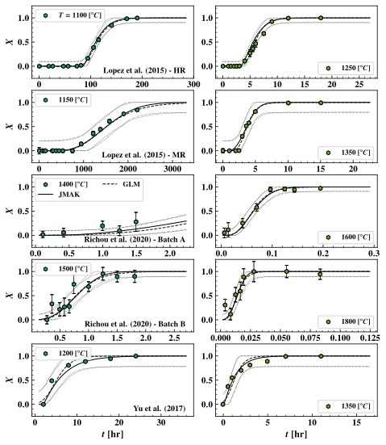
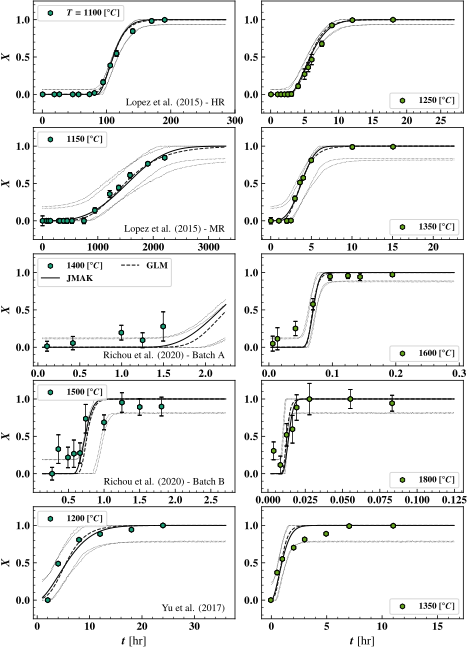
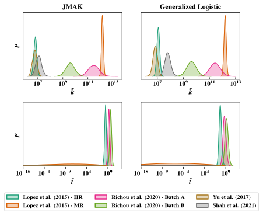

# Overview

**If you would like to jump straight into it, and look at the notebooks** please start [with the individual model inference](./model_inference/recrystillization_inference.ipynb).

## Summary
This project repository contains python scripts and data necessary to estimate the effect of recrystallization on the macroscopic material properties of tungsten (W) and W alloys. The goal is to develop a path function $Y(T(t)): \mathbb{R} \mapsto [0,1]$ which represents the fraction of recrystallized material based upon an arbitrary time history $T(t): \mathbb{R}_+ \to \mathbb{R}$ which is informed by experimental results and our understanding of the physical process. Second, a statistical estimate in the reduction of material hardness based on material recrystallization fraction, which is correlated to the material yield strength, an important macroscopic material property is detailed. 
A few sample applications of the results of this inference and development are summarized in [sample_applications.md](./sample_applications.md)

## Novel Contributions
This repository makes the following contributions, which are novel to the best of my knowledge.
1. Bayesian parameter calibration and comparison of two models for material recrystallization fraction.
2. Development of Empirical Intra-material recrystallization fraction material model 
    1. Identification \& development of characteristic material model property
    2. Specification \& calibration of intra-material recrystallization fraction material model 
3. Demonstration of connection between discrete model formulations in the literature and General Additivity for continuous material recrystallization fraction for non-isothermal conditions *

*With discrete models proposed and used in A. Durif _et al._ , C. Li _et al._ , F. Fernandes _et al._ , W. Pumphrey

# Material recrystallization 

## Physical Description 
Recrystallization of the warm-rolled tungsten plate is a thermally activated _phase-change_ process governed by jumps of individual tungsten atoms. At a macroscopic level, the isothermal recrystallization fraction $X(t)$ in an _isothermal_ experiment is measured by monitoring the material hardness over time, judging the phase using the law of mixtures. An example plot of $X(t)$ at $T = 1150 \ ^\circ C,1175 \ ^\circ C$ using data from A. Lopez is shown in the below figure, with predictions using a generalized logistic model. Evidently, the process is dependently upon both temperature and time. 

%20-%20MR_data_example.svg)

## Mathematical Modeling of recrystallization
I assess the fitting and extrapolative capabilities of two models (1) The (modified) Johnson–Mehl–Avrami–Kolmogorov (JMAK) model and (2) a generalized logistic (GL) model to fit observed experimental data by sampling the model(s) parameter posterior probability distribution functions (referred to as the _posteriors_) implied by an assumed gaussian error model on the experimental data. This is completed in two fashions (1) considered data sets in an independent manner and obtain separate parameter posteriors for each data set, and (2) proposing an empirical model that allows joint calibration across data sets. The notebooks used to develop this calibration are contained in [data_exploration](./data_exploration/) and [model_inference](./model_inference/).

### Mathematical Models
The selected models are quite similar though not identical. The like parameters in each model play similar roles.

#### Johnson–Mehl–Avrami–Kolmogorov (JMAK) Model
The parameters of interest are the incubation time $t_{inc}$, the exponent, $n$, and the rate coefficient $b$. $A_1,B_1,A_2,B_2$ are parameters involved in the Arrhenius process description of the temperature dependence of $b$ and $t_{inc}$ on $T$. 

$$
\begin{matrix}
X(t,T) = 1 - \exp{\left( -b^n (t - t_{inc})^n \right)} \\ 
b(T) = A_1 \exp{\left(B_1/T \right)} \\ 
t_{inc}(T) = A_2 \exp{\left(B_2/T \right)} 
\end{matrix}
$$

#### Generalized Logistic (GL) Model
We suppose that the recrystallization fraction may be modeled using a (generalized) logistic (GL) growth function. The temperature dependence follows through the Arrhenius process modeled for the growth rate $B$ and starting time $M$.

```math
\begin{matrix}
X(t,T) = \frac{1}{(1 + e^{-B (t - M)})^{1/\nu}} \\ 
B(T) = A_1 \exp{\left(B_1/T \right)} \\ 
M(T) = A_2 \exp{\left(B_2/T \right)} 
\end{matrix} 
```


### Bayesian Calibration of recrystallization Fraction State Function
The general structure for calibration adopted here assumes that we have a _parametric model_ for recrystallization fraction $X(t,T) = f(t,T ;\theta)$ which is continuous in time $t$ and _isothermal_ temperature $T$ with some parameter vector $\theta \in \mathbb{R}^{p}$ ($p = 5$ for both GL and JMAK models). With data $\mathcal{D} = \lbrace (t_i,T_i),X_i\rbrace_{i = 1}^n$, that is, observations of recrystallization fraction $X_i$ at time $t_i$ and isothermal temperature $T_i$ then the error between the observation and model follow a gaussian error structure:


$X_i \sim \mathcal{N}(f(t_i,T_i;\theta),\sigma^2 \mathbf{I} + \Xi)$

Where $\sigma^2$ is some model inadequacy and $\Xi = \text{diag}(\xi_i^2)$ are known experimental error. The joint distributions of the model errors is then the likelihood, which is related to the distribution of the parameter posteriors using [Bayes rule](https://en.wikipedia.org/wiki/Bayesian_statistics) as:

$p(\theta | \mathcal{D}) \propto \mathcal{L}(\mathcal{D} | \theta) p(\theta)$

Despite the simple specification of the problem, the specifics involved in estimation of $\theta$ are involved due to the non-linear dependence of recrystallization fraction $X$ on both $t$ and $T$. The following outline overviews how I estimate $p(\theta | \mathcal{D})$ with specifics of both the JMAK and GL detailed in [recrystallization_inference.ipynb](./model_inference/recrystillization_inference.ipynb)

#### Estimation of Arrhenius Process Parameters via Linear Regression
It is useful to obtain good initial guesses model parameters by linearization and subsequent  parameter approximate estimation in the notebooks [arrhenius_process_esimation.ipynb](./data_exploration/arrhenius_process_estimation.ipynb).

#### Initial Estimation Using Non-Linear Least Squares
Building upon the results of [arrhenius_process_esimation.ipynb](./data_exploration/arrhenius_process_estimation.ipynb), I used a non-linear least squares approach to the estimate of model parameters prior to inference [initial_least_squares_comparison.ipynb](./data_exploration/initial_least_squares_comparison.ipynb).

#### Separate Inference Across Data Sets
In [recrystallization_inference.ipynb](./model_inference/recrystillization_inference.ipynb) I calibrated both the JMAK and GL models to each recrystallization fraction data set independently, using the [prior_estimates](data_exploration/initial_least_squares_comparison.ipynb) of model parameters.

#### Latent Variables for Each Data Sets 
Drawing conclusions about the correlation of various recrystallization fraction models observed  [here](./model_inference/recrystillization_inference.ipynb), I explore the potential of these relationships in [latent_variable_selection](./model_inference/latent_variable_selection.ipynb) for reducing model complexity. I propose and calibrate a hierarchical model for recrystallization across data sets in [hierarchical_recrystallization.ipynb](./model_inference/hierarchical_recystillization_inference.ipynb).

### Extending the recrystallization Fraction State Function Model(s) to Non-isothermal Conditions
recrystallization experiments are performed isothermally, and the subsequent modeling assumes this condition. It is often the case that isothermal/constant conditions can NOT be relied upon. I extend the continuous time isothermal JMAK and GL models to continuous time non-isothermal analogues, inspired by discrete formulations in the literature (1-4) in [nonisothermal_modeling](./nonisothermal_modeling) and verify the formulation [numerically](./nonisothermal_modeling/non-isothermal_rx.ipynb). The basic assumption is that the rate of temperature change does not effect the recrystallization process.

### Estimating Reduction in Material Hardness
Material yield strength is linearly related to hardness (Tabor's relationship). It's reasonable to expect that a reduction in material hardness will result in a corresponding  fractional reduction in yield strength. Using measured tungsten hardness data during recrystallization experiments, the expected reduction in material hardness is estimated in [hardness_rx_model.ipynb](./model_inference/hardness_rx_model.ipynb) and assumed to be less than $\mathbf{22}$\%.

# Results
Some results of this work are provided below. The full results are contained in each of the notebooks referenced in the above sections.

## Calibration Results
The below figure shows visualizations of the JMAK and Generalized Logistic models predictive distributions for recrystallization fraction calibrated to each of the five experimental data sets separately [here](./model_inference/recrystillization_inference.ipynb), demonstrated for two temperatures. The dotted lines tracing the envelopes around the maximum likelihood predictions for either model (solid and dashed black lines) are 95% confidence intervals, based on the experimental error and model inadequacy discovered during calibration. There is little visual difference in the models abilities to predict the data once calibrated.



_Posterior predictive distribution visualization comparison of JMAK vs. Generalized Logistic models fitted independently to various data sets_

Sample marginal posteriors for the JMAK and GL models are demonstrated in the below figure (using kernel density estimation). Similar parameters play similar roles between the two models, though there appears to be more resolution between exponent ($n$ and $\nu$ for the JMAK and GL models respectively) for the GL model than the JMAK.


_Marginal JMAK/GL model parameter posterior distributions obtained calibrating to data sets independently_

The next figure visually compares the predictive distributions using the combined/hierarchical modeling approach (detailed [here](./model_inference/hierarchical_recystillization_inference.ipynb)) which calibrates a material model jointly to all experimental data sets. This approach allows for _interpolation_ between data sets using _interpretable_ material parameters.



_Posterior predictive distribution visualization comparison of JMAK vs. Generalized Logistic models fitted jointly to the various data sets_

There is little visual difference between model posterior predictions obtained by calibration separately to the datasets _vs._ jointly. The below table compares the model inadequacy estimated standard deviation when calibrating each data set individually vs. the combined model form. The model inadequacy increases somewhat in each scenario however the quality of the predictions is not impacted significantly and the combined model provides a straightforward way to interpolate between different tungsten's, and extrapolate to tungsten's with required properties.

**Independent vs. Combined Error Comparison**:Recrystallization model inadequacy standard deviation comparison across datasets
|                                |   individual |   combined |
|:-------------------------------|-------------:|-----------:|
| Lopez et al. (2015) - HR       |       0.0287 |     0.0323 |
| Lopez et al. (2015) - MR       |       0.0813 |     0.0844 |
| Richou et al. (2020) - Batch A |       0.0216 |     0.0581 |
| Richou et al. (2020) - Batch B |       0.021  |     0.0879 |
| Yu et al. (2017)               |       0.1022 |     0.1053 |

Posteriors of the latent variables $\ln{(\overline{k})}$, $\ln{(\overline{t})}$ which indicate the mean recrystallization and incubation times of the particular tungsten, obtained during inference of the hierarchical model, are shown in the below figure:



The latent variable $\ln{(\overline{k})}$ is very similar between the two models, and effectively demonstrates for which tungsten recrystallization proceeds most quickly (Yu _et al._) vs. for which tungsten the recrystallization proceeds least quickly (Lopez _et al._ MR).

Finally, the mean, maximum likelihood, and standard deviation of the latent variables for each tungsten, and the latent parameters for the combined model are provided in the below tables. These can be used in conjunction with the model specified [here](./model_inference/hierarchical_recystillization_inference_truncated_normal.ipynb) to predict the recrystallization fraction of a particular tungsten at some time and temperature.

**JMAK**: Summary of Posterior Distributions  $\ln{(\overline{k})}$ -- $\ln{(\overline{t})}$
|                                |    ml |   mean |   std |      ml |    mean |   std |
|:-------------------------------|------:|-------:|------:|--------:|--------:|------:|
| Lopez et al. (2015) - HR       | 16.05 |  15.65 |  0.26 |   18.32 |   19.18 |  0.53 |
| Lopez et al. (2015) - MR       | 28.43 |  28.01 |  0.16 |   11.15 |   -8.94 | 17.12 |
| Richou et al. (2020) - Batch A | 27.56 |  26.39 |  0.93 |   20.32 |   21.37 |  0.58 |
| Richou et al. (2020) - Batch B | 20.62 |  22.1  |  0.8  |   21.39 |   22.57 |  0.59 |
| Yu et al. (2017)               | 16.48 |  15.55 |  0.38 |   16.28 |  -42.96 | 47.15 |
| Shah et al. (2021)             | 16.8  |  16.28 |  0.51 | -125.43 |  -190.3 | 92.28 |

**Generalized Logistic** : Summary of Posterior Distributions $\ln{(\overline{k})}$ -- $\ln{(\overline{t})}$
|                                |    ml |   mean |   std |    ml   |   mean |   std |
|:-------------------------------|------:|-------:|------:|--------:|-------:|------:|
| Lopez et al. (2015) - HR       | 16.26 |  16.29 |  0.24 |   15.32 |   17.2 |  0.79 |
| Lopez et al. (2015) - MR       | 28.24 |  28.09 |  0.19 |  -16.51 | -14.92 | 17.29 |
| Richou et al. (2020) - Batch A | 26.85 |  26.33 |  0.87 |   17.42 |  19.95 |  0.97 |
| Richou et al. (2020) - Batch B | 20.7  |  22.15 |  0.79 |   18.58 |   21.3 |  1.01 |
| Yu et al. (2017)               | 16.8  |  15.74 |  0.38 | -116.27 | -55.36 | 41.88 |
| Shah et al. (2021)             | 17.48 |  17.96 |  0.49 | -126.85 | -86.77 | 54.91 |

**JMAK Parameters**: Summary of Posterior Distributons
|          |        ml |      mean |     std |
|:---------|----------:|----------:|--------:|
| $c_{11}$ |   -16.235 |   -16.599 |   0.201 |
| $c_{12}$ |   -29.765 |   -31.024 |   0.518 |
| $c_{13}$ | 16880.4   | 16765.5   | 258.846 |
| $c_{14}$ | 32959.9   | 33509.4   | 703.807 |
| $c_{15}$ |     0.008 |     0.549 |   0.09  |
| $c_{21}$ |     1.719 |     1.726 |   0.009 |
| $c_{22}$ |     0.453 |     0.448 |   0.011 |
| $c_{23}$ | -3011.52  | -3006.54  |  11.347 |
| $c_{24}$ |   760.279 |   766.274 |  14.562 |
| $c_{25}$ |     0.075 |     0.056 |   0.004 |


**Generalized Logistic Parameters**: Summary of Posterior Distributons
|          |        ml |      mean |    std |
|:---------|----------:|----------:|-------:|
| $c_{11}$ |   -16.154 |   -16.078 |  0.191 |
| $c_{12}$ |   -27.037 |   -28.842 |  0.681 |
| $c_{13}$ | 17170.9   | 17170.9   |  0.006 |
| $c_{14}$ | 33640.4   | 33640.4   |  0     |
| $c_{15}$ |     0.572 |     0.28  |  0.013 |
| $c_{21}$ |     1.754 |     1.746 |  0.008 |
| $c_{22}$ |     0.349 |     0.309 |  0.016 |
| $c_{23}$ | -3023.18  | -3024.56  |  3.171 |
| $c_{24}$ |   889.083 |   929.796 | 22.182 |
| $c_{25}$ |    -0.016 |    -0.005 |  0.001 |


## Data Sources and Work Cited
I would like to acknowledge the exceptional scientific work and considerable effort in obtaining these measurements by the authors of the studies from where I obtained the recrystallization data:

### Reference Works
1. A. Durif _et al._ _Numerical study of the influence of tungsten recrystallization on the divertor component lifetime_ , International Journal of Fracture (2021) [DOI](https://doi.org/10.1007/s10704-021-00568-1)
2. C. Li _et al._ _Numerical analysis of recrystallization behaviors for W monoblock under cyclic high heat flux_, Nuclear Materials and Energy (2022) [DOI](https://doi.org/10.1016/j.nme.2022.101227)
3. F. Fernandes _et al._ _Mathematical model coupling phase transformation and temperature evolution during quench of steels_, Materials Science \& Technology (1985) [DOI](https://doi.org/10.1179/mst.1985.1.10.838)
4. W. Pumphrey Inter-relation of hardenability and isothermal transformation data, JISI (1948)

### Data Sources
1. A. Lopez, _Thermal Stability of Warm-Rolled Tungsten_, Ph.D. Thesis, Technical University of Denmark (2015).
2. M. Richou _et al_. _recrystallization at high temperature of two tungsten materials complying with the ITER specifications, Journal of Nuclear Materials_ (2020) [DOI](https://doi.org/10.1016/j.jnucmat.2020.152418)
3. Yu _et al_. _Hardness loss and microstructure evolution of 90% hot-rolled pure tungsten at 1200-1350 C_, Fsion Engineering and Design (2017) [DOI](http://dx.doi.org/10.1016/j.fusengdes.2017.05.072)
4. Wang _et al_. _Effects of thickness reduction on recrystallization process of warm-rolled pure tungsten plates at 1350 C_, Fusion engineering and Design (2017) [DOI](http://dx.doi.org/10.1016/j.fusengdes.2017.03.140)
5. K. Tsuchida _et al._ _Recrystallization behavior of hot-rolled pure tungsten and its alloy plates during high-temperature annealing_ Nuclear Materials and Energy (2018) [DOI](https://doi.org/10.1016/j.nme.2018.04.004)
6. M. Minissale _et al._ _A high power laser facility to conduct annealing tests at high temperature_ Review of Scientific Instruments (2020) [DOI](https://doi.org/10.1063/1.5133741)
7. Ciucani _et al._ _Recovery and recrystallization kinetics of differently rolled, thin tungsten plates in the temperature range from 1325 °C to 1400 °C_ Nuclear Materials and Energy (2020) [DOI](https://doi.org/10.1016/j.nme.2019.100701)
