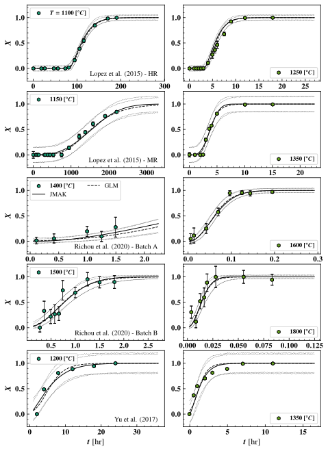
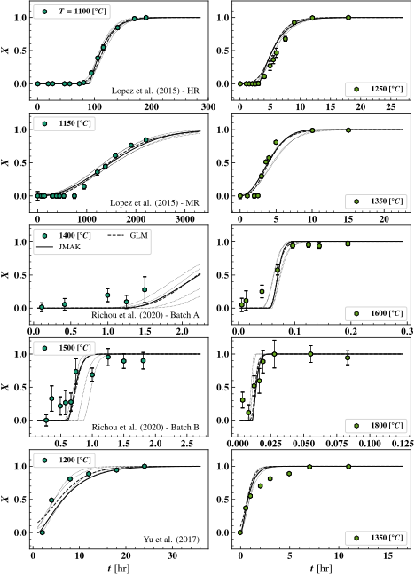
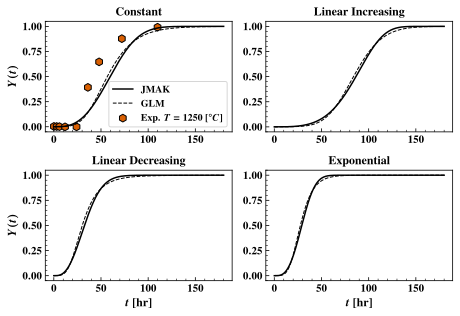

# Overview
TO-DO: 
1. _quantiative comparison_ between models/data set models
2. Visual aid for recrystillization fraction
3. Description/distinction of non-isothermal vs. isothermal recrystillization
4. Sample applications 
5. Edit with Chatgpt

## Summary
This project repository contains python scripts and data neccessary to estimate the effect of recrystillization on the macroscopic material properties of tungsten (W) and W alloys. 
The goal is to develop a path function $Y(T(t)): \mathbb{R} \mapsto [0,1]$ which represents the fraction of recrystillized material based upon an arbitary time history $T(t): \mathbb{R}_+ \to \mathbb{R}$. 
Second, a statistical estimate in the reduction of material hardness based on material recrystillization fraction, which is correlated to the material yield strength, an important macroscopic material property is detailed. 

## Novel Contributions
This repository makes the following contributions, which are novel to the best of my knowledge.
1. Bayesian parameter calibration and comparison of two models for material recrystillization fraction.
2. Development of Empirical Intra-material recrystillization fraction material model 
    1. Identification \& develoment of characteristic material model property
    2. Specification \& calibration of intra-material recrystillization fraction material model 
3. Derivation and numerical validation of continuous material recrystillization fraction for non-isothermal conditions*

*Building on discrete models proposed and used in:

1. A. Durif _et al._ _Numerical study of the influence of tungsten recrystallization on the divertor component lifetime_ , International Journal of Fracture (2021) [DOI](https://doi.org/10.1007/s10704-021-00568-1)
2. C. Li _et al._ _Numerical analysis of recrystallization behaviors for W monoblock under cyclic high heat flux_, Nuclear Materials and Energy (2022) [DOI](https://doi.org/10.1016/j.nme.2022.101227)
3. F. Fernandes _et al._ _Mathematical model coupling phase transformation and temperature evolution during quench of steels_, Materials Science \& Technology (1985) [DOI](https://doi.org/10.1179/mst.1985.1.10.838)
4. W. Pumphrey Inter-relation of hardenability and isothermal transformation data, JISI (1948)

## Data Sources

# Material Recrystillization 

## Physical Description 
Recrystallization of the warm-rolled tungsten plate is a thermally activated _phase-change_ process governed by jumps of individual tungsten atoms. At a macroscopic level, the recrystillization fraction $X$ in an _isothermal_ experiment is measured by monitoring the material hardness over time, judging the phase using the law of mixtures. The simplest mathematical model for this process begins with a spatial poisson distributed nucleation sites of the recrystillized material that grow exponentially until the entire volume of the new material is consumed by this new phase.

## Mathematical Modeling of Recrystillization
I assess the fitting and extrapolative capabilities of two models (1) The (modified) Johnson–Mehl–Avrami–Kolmogorov (JMAK) model and (2) a generalized logistic (GL) model to fit observed experimental data by sampling the model(s) parameter posterior probability distribution functions (referred to as the _posteriors_) implied by an assumed gaussian error model on the experimental data. This is completed in two fashions (1) considered data sets in an independent manner and obtaining seperate parameter posteriors for each data set, and (2) proposing an empirical model that allows joint calibration across data sets. The notebooks used to develop this calibration are contained in [data_exploration](/data_exploration/) and [model_inference](/model_inference/).

### Bayesian Calibration of Recrystillization Fraction State Function
The general structure for calibration adopted here assumes that we have a _parametric model_ for recrystillization fraction $X = f(t,T ;\theta)$ which is continuous in time $t$ and _isothermal_ temperature $T$ with some parameter vector $\theta \in \mathbb{R}^{p}$ ($p = 5$ for both GL and JMAK models). if we have data $\mathcal{D} = \{(t_i,T_i),X_i\}_{i = 1}^n$ that is observations of recrystillization fraction $X_i$ at time $t_i$ and isothermal temperature $T_i$ then the error between the observation and model follow a gaussian error structure:

$
X_i \sim \mathcal{N}(f(t_i,T_i;\theta),\sigma^2 \mathbf{I} + \Xi)
$

Where $\sigma^2$ is some model inadequecy and $\Xi = \text{diag}(\xi_i^2)$ are known experimental error. The joint distributions of the model errors is then the likelihood, which is related to the distribution of the paramter posteriors using [Bayes rule](https://en.wikipedia.org/wiki/Bayesian_statistics)] as:

$
p(\theta | \mathcal{D}) \propto \mathcal{L}(\mathcal{D} | \theta) p(\theta)
$

Despite the simple specification of the problem, the specifics involved in estimation of $\theta$ are involved due to the exponential,non-linear dependence of recrystillization fraction $X$ on both $t$ and $T$. The following outline gives a brief overview of how I estimate $p(\theta | \mathcal{D})$ with specifics of both the JMAK and GL detailed in [recrystillization_inference.ipynb](/model_inference/recrystillization_inference.ipynb)

#### Estimation of Arrhenius Process Parameters via Linear Regression
Both the GL and JMAK models are fairly nonlinear and it is useful to obtain good initial guesses model parameters by linearization and subsequent  parameter approximate estimation in the notebooks [arrhenius_process_esimation.ipynb](data_exploration/arrhenius_process_estimation.ipynb).

#### Initial Estimation Using Non-Linear Least Squares
Bulding upon the results of [arrhenius_process_esimation.ipynb](data_exploration/arrhenius_process_estimation.ipynb), I used a non-linear least squares approach to refine the least squares estimation of the model parameters prior to inference [initial_least_squares_comparison.ipynb](data_exploration/initial_least_squares_comparison.ipynb).

#### Seperate Inference Across Data Sets

#### Latent Variables for Each Data Sets 

### Extending the Recrystillization Fraction State Function Model(s) to Non-isothermal Conditions
TO - DO

### Estimating Reduction in Material Hardness
Material yield strength is linearly related to hardness (Tabor's relationship). It's reasonable to expect that a reduction in material hardness will result in a corresponding frational reduction in yield strength. 
Using measured tungsten hardness data during recrystillization experiments, the expected reduction in material hardness is estimated in [hardness_rx_model.ipynb](hardness_rx_model.ipynb) and assumed to be less than $\mathbf{22}$ \%.

# Results

## Calibration Results
The below figure shows visualizations of the JMAK and Generalized Logisitic models predictive distributions for recrystillization fraction calibrated to each of the five experimental data sets seperately [here](/model_inference/recrystillization_inference.ipynb), demonstrated for two temperatures. The dotted lines tracing the envelopes around the maximum likelihood predictions for either model (solid and dashed black lines) are 95% confidence intervals, based on the experimental error and model inadequecy discovered during calibration. There is little visual difference in the models ablities to predict the data once calibrated.

_Posterior predictive distribution visualization comparison of JMAK vs. Generalized Logistic models fitted independently to various data sets_

Sample marginal posteriors for the JMAK and GL models are demonstrated in the below figure (using kernel density estimation). Similar parameters play similar roles between the two models, though there appears to be more resolution between exponent ($n$ and $\nu$ for the JMAK and GL models respectively) for the GL model than the JMAK.

_Marginal JMAK/GL model parameter posterior distributions obtained calibrating to data sets independently_

The next figure visually compares the predictive distributions using the combined/hierarchical modeling approach (detailed [here](model_inference/hierarchical_recrystillization_inference.ipynb)) which calibrates a material model jointly to all experiemental data sets. This approach allows for _interpolation_ between data sets using _interpretable_ material parameters.

_Posterior predictive distribution visualization comparison of JMAK vs. Generalized Logistic models fitted jointly to the various data sets_

There is little visual difference between model posterior predictions obtained by calibration seperately to the datasets _vs._ jointly. 

## Sample Applications

### Time-to-recrystillization

**JMAK 1-year Recrystillization Temperature [$^\circ C$]**:The temperature required to achieve a recrystillization fraction of $0.9$ after $1$ year.
|                                |   ML |   Lower 95\% |   Upper 95% |
|:-------------------------------|-----:|-------------:|------------:|
| Richou et al. (2020) - Batch A | 1117 |         1081 |        1149 |
| Lopez et al. (2015) - MR       | 1113 |         1108 |        1114 |
| Richou et al. (2020) - Batch B | 1076 |         1017 |        1120 |
| Lopez et al. (2015) - HR       |  937 |          933 |         952 |
| Yu et al. (2017)               |  N/A |          N/A |         914 |

**Generalized Logistic 1-year Recrystillization Temperature [$^\circ C$]**:The temperature required to achieve a recrystillization fraction of $0.9$ after $1$ year.
|                                |   ML |   Lower 95\% |   Upper 95% |
|:-------------------------------|-----:|-------------:|------------:|
| Richou et al. (2020) - Batch A | 1123 |         1082 |        1145 |
| Lopez et al. (2015) - MR       | 1115 |         1109 |        1115 |
| Richou et al. (2020) - Batch B | 1075 |         1016 |        1107 |
| Lopez et al. (2015) - HR       |  968 |          944 |         982 |
| Yu et al. (2017)               |  867 |          N/A |         853 |

### Non-isothermal Model Analysis

