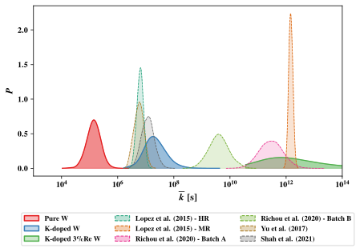

# Overview
This markdown summarizes some applications where the results from the calibration and model development prove useful.

### 1. Time-to-Recrystillization Estimation
Using the calibrated models we can **predict the _time to recrytillization fraction_ for any $X = X^*$**. A sample of this sort of analysis is shown in the figure below, using the JMAK models calibrated independently to each data set, for a recrystillization fraction $X^* = 0.9$. The interpretation being that at the temperature specified on the horizontal axis, it will take the amount of time specified on the y-axis to reach a recrystillization fraction of $X^* = 0.9$. Note the different temperature ranges on the horizontal axis, clearly the two tungsten's on the left panel are more resistant to recrystilization. The gray envelopes are 95% confidence intervals.

_Time to recrystillization of_ $X^* = 0.9$ _for different tungstens as a function of temperature_

If we fix our time at $t_{operating} = 1$ year, this corresponds to a unique temperature for each alloy. These temperatures are summarized in the below tables for the JMAK and GL models with 95% confidence intervals shown: ML means "most likely", an estimate made using the maximum likelihood estimate of the model paramters. The greater uncertainty in Richou et al.'s data means that the confidence intervals are considerably larger. Surprisingly, using the GL model produces much greater temperature estimates than the JMAK model for Lopez et al. (2015) - HR. 

**JMAK 1-year Recrystillization Temperature** [$^\circ$ C]: The temperature required to achieve a recrystillization fraction of $0.9$ after $1$ year.
|                                |   ML |   Lower 95\% |   Upper 95% |
|:-------------------------------|-----:|-------------:|------------:|
| Richou et al. (2020) - Batch A | 1117 |         1081 |        1149 |
| Lopez et al. (2015) - MR       | 1113 |         1108 |        1114 |
| Richou et al. (2020) - Batch B | 1076 |         1017 |        1120 |
| Lopez et al. (2015) - HR       |  937 |          933 |         952 |
| Yu et al. (2017)               |  N/A |          N/A |         914 |

**Generalized Logistic 1-year Recrystillization Temperature** [$^\circ C$]: The temperature required to achieve a recrystillization fraction of $0.9$ after $1$ year.
|                                |   ML |   Lower 95\% |   Upper 95% |
|:-------------------------------|-----:|-------------:|------------:|
| Richou et al. (2020) - Batch A | 1123 |         1082 |        1145 |
| Lopez et al. (2015) - MR       | 1115 |         1109 |        1115 |
| Richou et al. (2020) - Batch B | 1075 |         1016 |        1107 |
| Lopez et al. (2015) - HR       |  968 |          944 |         982 |
| Yu et al. (2017)               |  867 |          N/A |         853 |

### 2. Non-isothermal Model Analysis

#### 2a. Modeling Recrystillization fraction $Y(t)$ with Arbitary Temperature Histories $T(t)$
It is often the case that the temperature experienced by the tungsten is not isothermal in real applications. We can use the model developed and validated in [nonisothermal_modeling](/nonisothermal_modeling) to **predict the recrystillization fraction based upon an arbitary temperature history**. This is demonstrated in the below figure. The first (upper left panel) compares the nonisothermal model predictions for the isothermal case with the experimental data comparing both the JMAK and GL models. The recrystillization in the linear decreasing temperature case proceeds much more quickly at the beggining due to the higher temperature, while slowing towards the end, with the opposite trend experienced in the linear increasing. The exponential is similar in nature to the linear decreasing temperature.

_Nonisothermal recrystilization fractions using several different temperature profiles_

#### 2b. Non-isothermal Model Interpretation
The non-isothermal model for recrystillization in the JMAK model is:
$Y(t)  = \begin{cases}
0 \qquad & t \leq t_0 \\ 
Y^{\dagger}(t - t_0) \qquad & t > t_0 \\ 
\end{cases}$

$t_0 = \rho^{-1}(1) \qquad \rho = \int \frac{d \tau}{t_{inc}(T(\tau))}$

$Y^{\dagger} = 1 - \exp{\left\{- \left( \int b(T(\tau)) d\tau \right)^n  \right\}}$

Importantly, there is no _direction_ associated with these integrals, meaning that the _order_ of temperatures does not matter, only the integral. That is to say the functions:

$T(t) = \frac{\bar{T}}{2} (1 + t) \qquad 0 \leq t \leq 1$

and 

$T(t) = \frac{\bar{T}}{2} (2 - t) \qquad 0 \leq t \leq 1$

will result in the same recrystillization fractions at $t = 1$ (or relative incubation fraction), despite the fact that the first function is increasing whilst the second decreasing. An identical conclusion may be drawn from the non-isothermal formulation of the GL model.

### 3. Using the Combined Model 

#### 3a. Extending Combined Model to Calibrate with Limited Data
The recrystilization experimental data published in [K. Tsuchida](https://www.sciencedirect.com/science/article/pii/S2352179117301886?via%3Dihub) for several tungsten alloys demonstrates a common situtation: Limited data is taken during an experiment to demonstrate the phenomonon of recrystillization, but not enough to fit the 2D function $X(t,T)$. The previous inferences using the hierarchical model 

$p(\mathbf{c} | \mathcal{D}) = \int p(\mathbf{c},\mathbf{\overline{k}},\mathbf{\overline{t}} | \mathcal{D}) d \mathbf{\overline{k}} d \mathbf{\overline{t}}$

Which may be treated as a _prior_ for a _new_ data set $\mathcal{D}^{new} = \{(\mathbf{X,t,T})_{new}\} $ (which has only one set). We want to estimate $\overline{k},\overline{t}$ for this data set. The below figure plots predictive posteriors of phase fraction $X$ for tungsten alloys from [K. Tsuchida](https://www.sciencedirect.com/science/article/pii/S2352179117301886?via%3Dihub) for three tungsten alloys using this approach (developed [here](./model_inference/inference_extension.ipynb)).

The Figure below compares marginal distributions for $\overline{k}$, the characteristic of recrystillization speed, obtained for the pure tungstens with sufficient data, and the tungsten alloys with limited data. The K-doped 3% Re alloy exhibits recrystillization resistance while the pure W and K-doped W from this study are not very resistant to recrystilization.

#### 3b. Extrapolating to Future Tungsten/Tungsten Alloys